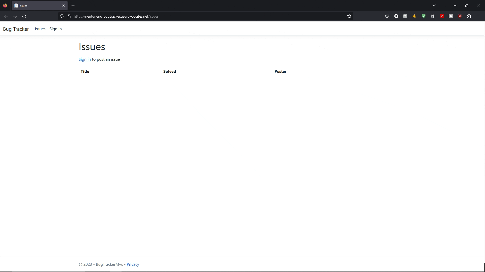

## About

BugSmashers is a fullstack issue/bug tracker build with TypeScript-React and ASP.NET Core.

Users can create projects and keep track of issues, similarly to GitHub.

## Project Demos

## Installation and Setup

- Clone or download the repository.
- Create the `appsettings.json` file in the main project's directory and fill in:
	- Either a local SQL server connection string or Azure SQL server connection string for `AZURE_SQL_CONNECTIONSTRING`
	- Your GitHub OAUTH Application credentials

## Reflection

BugSmashers v1 was an ASP.NET MVC application, and it served as a way to learn C# and ASP.NET.

I decided to come back and apply new skills and knowledge, as well as shift the project over to ASP.NET Core API.

The frontend was built with React-TypeScript. 
To make things different, I decided to incorporate C# and OOP principals to created a service layer that handled all API functionality in the program.

The biggest challenge of fullstack applications, particularly those that have a backend on a different domain, is cookie authentication.
The solution to this problem was adding an additional layer to the authentication which would use the cookie created by the social login to generate a JWT that would then be sent to the frontend.
