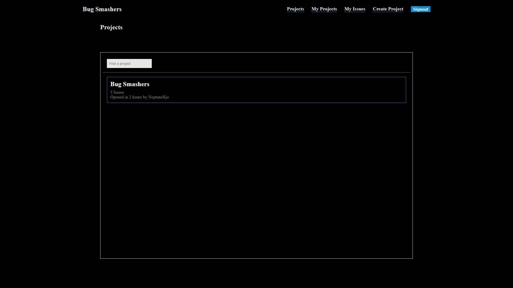

## About

This is a issue/bug tracker built with ASP.NET using MVC.

Users can sign in with their GitHub credentials and post issues to the page.
Posters can edit their issues at any time, and marking as solved will not delete the issue from the board but issues can still be deleted.

Discussions are open on each issue, and authenticated users can post comments.

Visit the demo [here](https://neptunerjo-bugtracker.azurewebsites.net/issues)

## Project Demos

## Installation and Setup

- Clone or download the repository.
- Create the `appsettings.json` file in the main project's directory and fill in:
	- Either a local SQL server connection string or Azure SQL server connection string for `AZURE_SQL_CONNECTIONSTRING`
	- Your GitHub OAUTH Application credentials

## Reflection

This project serves as a deep-dive learning experience so that I could learn C# and ASP.NET.

There were various challenges throughout this project, ranging from general learning curves to authentication and deployment.
I went through a couple of refactors in order to figure out certain aspects of an application, such as seperation of concerns and 
how ASP.NET works with Views.

Testing in C#/ASP.NET also had a learning curve. Mocking the db so repository functions could be tested was a little tricky,
but in the end I was able to get pretty decent coverage. I do however still have a lot to learn about unit testing and integration testing is a whole different beast.

